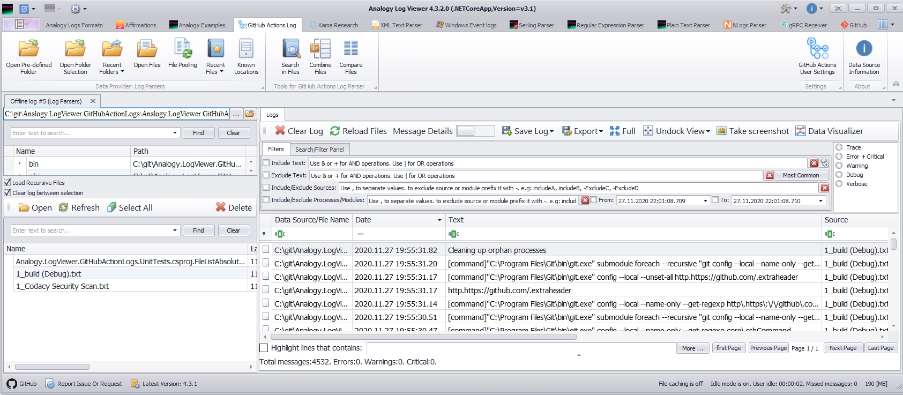

# Analogy.LogViewer.GithubActionLogs
Viewer for GitHub Action  logs

under settings you can map specific text to specific log level:

# Usage
1. Download [Analogy Log Viewer](https://github.com/Analogy-LogViewer/Analogy.LogViewer/releases),
2. Download the relevant version from the [release section](https://github.com/Analogy-LogViewer/Analogy.LogViewer.GitHubActionLogs/releases) and put it at the same folder as the application.

Note: From Analogy V4.3.2 you can download it directly from Analogy Application Update section.
